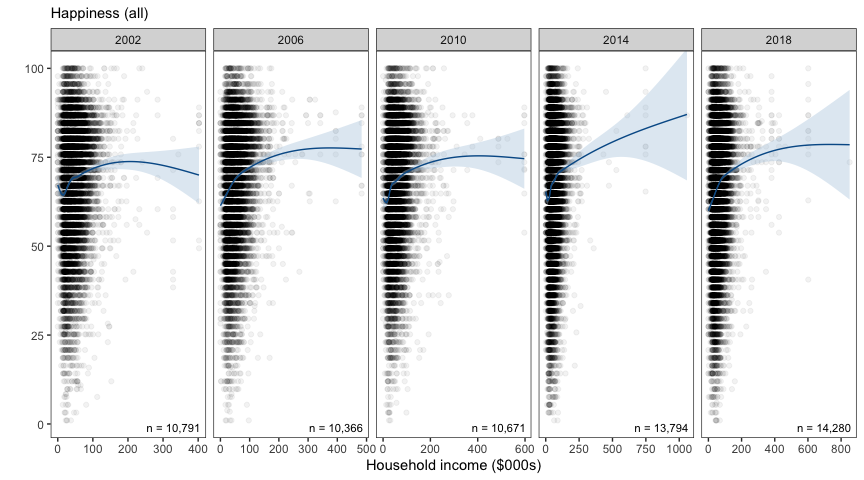
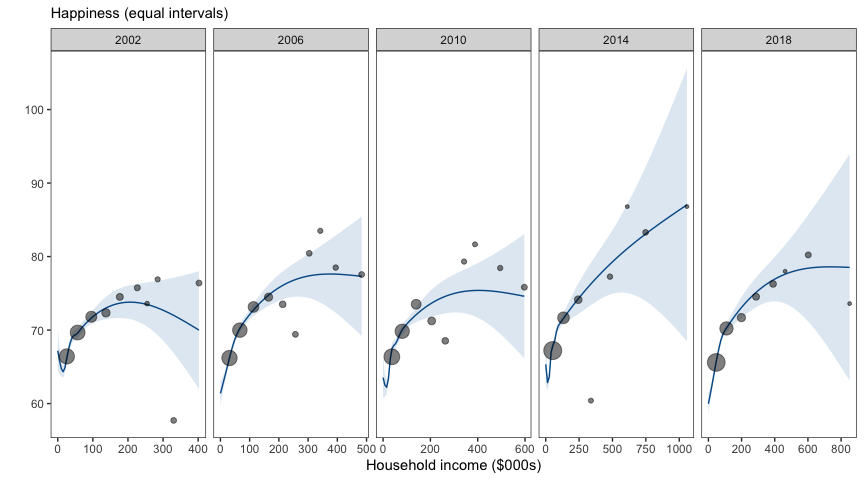
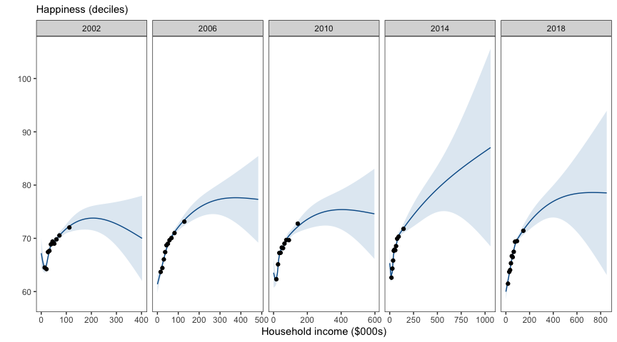

## Depicting large data

This is a brief examination of the effect of the bin design on data
visualization (e.g., scatter plots).

HILDA provides income and household wealth data on approximately 10,000
individuals each year. When visualizing large datasets of n \> 10,000
there are often too many points to distinguish patterns among the
individuals or even the overall trend - a problem sometimes known as
“over-plotting”. Models, or some kind of summary function, are needed
to provide an accurate or fair depiction of trends and patterns.
Measures of central tendency, or the expected value can also be used to
reduce the number of indiivdual points, however then the data must be
grouped or binned. Binning can occur by equal length or equal size.

Below we plot the relationship between income and happiness over five
years in HILDA. In each case, a smooth estimate with 95% confidence
intervals based on the entire dataset is shown in blue (a GAM -
generalized additive model with integrated smoothness: formula = y ~
s(x, bs = “cs”) with method = “REML”).

 

#### Unsummarized plots

These plots show each individual point (e.g., *n* = 10,791 in the first
panel).

<!-- -->

 

It is difficult to distinguish any underlying trend over the x-axis
(Household wealth), apart from the fact that observations tend to be
bunched up at the lower end of the wealth scale. In the figures below,
we summarise these 10,000 odd points by each of two methods: **equal
sized bins** or **equal interval (length) bins**.

In each case, the smoothed trend line based on the underlying individual
data is also overlaid, in order to compare the summary points against
the (“true”) underlying trend.

 

#### Equal interval bins

These plots summarise the 10,000 individual points in each panel into
ten equal sized intervals. Because the number of points in each interval
can vary, the size of each point reflects the number of observations
which contribute to each interval.

To construct the equal interval bins, the `cut_interval()` function
defined unique boundaries for each year to cover the distribution of
income. So each year had ten intervals but unique interval boundaries.

<!-- -->

 

It is easy to see that as the income scale increases, the size of the
points indicates fewer and fewer observations contribute to each
interval. Some intervals do not appear because no observations are
within the relevant range of income (see table below). The smaller
points on the right side of the income scale are also more likely to
fall outside the confidence interval of the smoothed trend line in blue.
Only the points with substantial observations on the left side of each
panel accurately represent the smoothed trend line (blue).

The ten bins have the following tallys in each year:

<table class="table" style="margin-left: auto; margin-right: auto;">

<caption>

Equal interval bin sizes

</caption>

<thead>

<tr>

<th style="text-align:right;">

dollar\_bin

</th>

<th style="text-align:right;">

2002

</th>

<th style="text-align:right;">

2006

</th>

<th style="text-align:right;">

2010

</th>

<th style="text-align:right;">

2014

</th>

<th style="text-align:right;">

2018

</th>

</tr>

</thead>

<tbody>

<tr>

<td style="text-align:right;">

1

</td>

<td style="text-align:right;">

9256

</td>

<td style="text-align:right;">

9654

</td>

<td style="text-align:right;">

11151

</td>

<td style="text-align:right;">

21173

</td>

<td style="text-align:right;">

19161

</td>

</tr>

<tr>

<td style="text-align:right;">

2

</td>

<td style="text-align:right;">

7466

</td>

<td style="text-align:right;">

6510

</td>

<td style="text-align:right;">

5795

</td>

<td style="text-align:right;">

1788

</td>

<td style="text-align:right;">

3749

</td>

</tr>

<tr>

<td style="text-align:right;">

3

</td>

<td style="text-align:right;">

1246

</td>

<td style="text-align:right;">

1009

</td>

<td style="text-align:right;">

685

</td>

<td style="text-align:right;">

105

</td>

<td style="text-align:right;">

199

</td>

</tr>

<tr>

<td style="text-align:right;">

4

</td>

<td style="text-align:right;">

206

</td>

<td style="text-align:right;">

180

</td>

<td style="text-align:right;">

150

</td>

<td style="text-align:right;">

7

</td>

<td style="text-align:right;">

49

</td>

</tr>

<tr>

<td style="text-align:right;">

5

</td>

<td style="text-align:right;">

58

</td>

<td style="text-align:right;">

38

</td>

<td style="text-align:right;">

35

</td>

<td style="text-align:right;">

28

</td>

<td style="text-align:right;">

58

</td>

</tr>

<tr>

<td style="text-align:right;">

6

</td>

<td style="text-align:right;">

18

</td>

<td style="text-align:right;">

13

</td>

<td style="text-align:right;">

10

</td>

<td style="text-align:right;">

3

</td>

<td style="text-align:right;">

2

</td>

</tr>

<tr>

<td style="text-align:right;">

7

</td>

<td style="text-align:right;">

10

</td>

<td style="text-align:right;">

16

</td>

<td style="text-align:right;">

6

</td>

<td style="text-align:right;">

0

</td>

<td style="text-align:right;">

0

</td>

</tr>

<tr>

<td style="text-align:right;">

8

</td>

<td style="text-align:right;">

8

</td>

<td style="text-align:right;">

12

</td>

<td style="text-align:right;">

1

</td>

<td style="text-align:right;">

8

</td>

<td style="text-align:right;">

18

</td>

</tr>

<tr>

<td style="text-align:right;">

9

</td>

<td style="text-align:right;">

13

</td>

<td style="text-align:right;">

9

</td>

<td style="text-align:right;">

10

</td>

<td style="text-align:right;">

0

</td>

<td style="text-align:right;">

0

</td>

</tr>

<tr>

<td style="text-align:right;">

10

</td>

<td style="text-align:right;">

14

</td>

<td style="text-align:right;">

12

</td>

<td style="text-align:right;">

12

</td>

<td style="text-align:right;">

1

</td>

<td style="text-align:right;">

1

</td>

</tr>

</tbody>

</table>

 

The tally in each bin dropped off quickly after the first few bins
(sometimes as early as the 4th bin). In more recent years (2014, 2018)
there are empty bins. This is a consequence of using equal length
intervals over a long-tailed distribution such as income (which is
especially long-tailed in recent years).

 

#### Decile bins

These plots summarise the 10,000 individual points in each panel into
ten equal sized bins (i.e., decile bins, each containing ~1000
observations).

<!-- -->

 

The ten equal sized decile bins produce points that tend to be bunched
up on the left side of the income axis. However this appropriately
reflects the portion of the income scale about which we can be most
confident.
