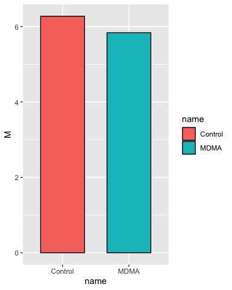
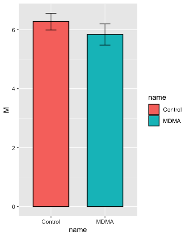
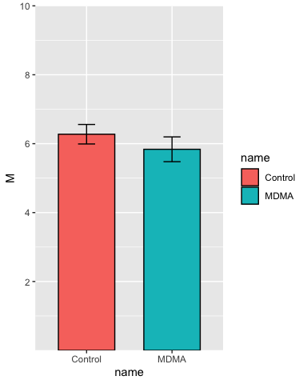
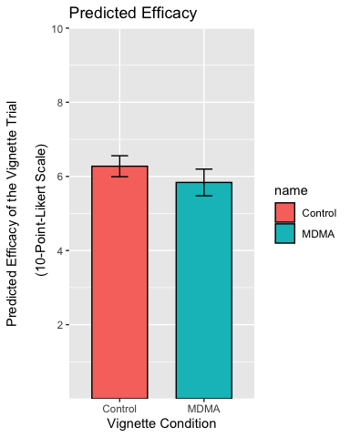
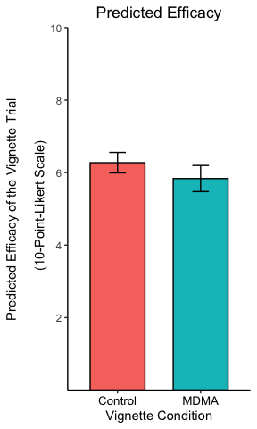
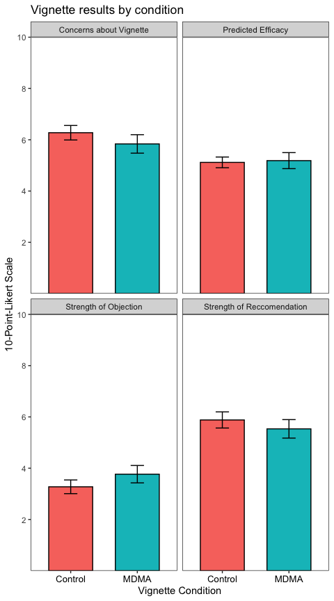

## R Markdown

This is an R Markdown document. Markdown is a simple formatting syntax
for authoring HTML, PDF, and MS Word documents. For more details on
using R Markdown see <http://rmarkdown.rstudio.com>.

## Tidyverse

We will need the **readxl** package from **tidyverse** to import the
excel file into R. We will need the **ggplot2** package from
**tidyverse** to create the plot. Tidyverse is a set of packages which
includes useful tools for data import into R (e.g., haven, readr,
readxl), data manipulation (e.g., dplyr, tidyr), as well as functional
programming (e.g., purrr). For more info about ggplot2 see
<https://ggplot2.tidyverse.org/index.html>.

If you haven’t installed tidyverse on your harddrive, then you will need
to download and install it. In RStudio, use the `Tools` menu and
`Install Packages...`, then type in “tidyverse” to download and install.

Or you can download and install it from the command line (console
window) in RStudio using `install.packages("tidyverse")`

In each case, the default options should work.

After installation, everytime we want to use a package in the tidyverse
we must load it into RAM using the `library` command. Normally this is
included as boilerplate at the top of your script. In this case we will
need to separately load the **readxl** package, because although it is
part of the tidyverse, it is not loaded by default with the
`library(tidyverse)` call unlike the other packages (e.g., ggplot2).

``` r
library(tidyverse)
```

    ## ── Attaching packages ─────────────────────────────────────── tidyverse 1.3.0 ──

    ## ✓ ggplot2 3.3.3     ✓ purrr   0.3.4
    ## ✓ tibble  3.0.6     ✓ dplyr   1.0.4
    ## ✓ tidyr   1.1.2     ✓ stringr 1.4.0
    ## ✓ readr   1.4.0     ✓ forcats 0.5.1

    ## ── Conflicts ────────────────────────────────────────── tidyverse_conflicts() ──
    ## x dplyr::filter() masks stats::filter()
    ## x dplyr::lag()    masks stats::lag()

``` r
library(readxl)
```

<br>

## Import

Often the hardest part is figuring out how to import excel files into R.
This is because excel is a terrible way to manage data and almost any
other method (STATA, SPSS, csv) is better (excel is a great way to play
with data). We need to know the sheet name and the cell reference of the
data in the worksheet we want. Examining the excel workbook reveals to
me there are four tables (each 2-columns wide) in a single sheet, so I’m
just going to import each table separately using `read_excel()` and the
cell references in Excel.

``` r
path_to_excel_file <- "../assets/WRIGHT_t-tests_primary outcome data.xlsx"

recommendations <- read_excel(path = path_to_excel_file,
                              range = "B3:C54") 

objections <- read_excel(path = path_to_excel_file,
                         range = "E3:F54") 

efficacy <- read_excel(path = path_to_excel_file,
                       range = "H3:I54") 

concerns <- read_excel(path = path_to_excel_file,
                       range = "K3:L54") 
```

Because `read_excel()` is a tidyverse function, it will import the
results as a tibble object (think of a “little table”), and tibbles are
very easy to work with. For instance, the results can be examined very
simply:

``` r
concerns
```

    ## # A tibble: 51 x 2
    ##    Control  MDMA
    ##      <dbl> <dbl>
    ##  1       7     2
    ##  2       4     7
    ##  3       8     7
    ##  4       8     8
    ##  5       5     8
    ##  6       4     8
    ##  7       7    10
    ##  8       6    10
    ##  9       9     5
    ## 10      10     7
    ## # … with 41 more rows

The printed output tells us `concerns` is a tibble, with 51 rows, 2
columns with headings “Control” and “MDMA” respectively. This is called
“wide” format, and while you are probably used to working with “wide”
tables, it is not a great format to manipulate with code. One reason is
because in it’s current form it contains missing values. `tail()` lets
us look at the bottom of the tibble:

``` r
tail(concerns, 10)
```

    ## # A tibble: 10 x 2
    ##    Control  MDMA
    ##      <dbl> <dbl>
    ##  1       1     6
    ##  2       3     4
    ##  3       4    NA
    ##  4       8    NA
    ##  5       7    NA
    ##  6       6    NA
    ##  7       7    NA
    ##  8       5    NA
    ##  9       7    NA
    ## 10       5    NA

The final 8 rows of MDMA are filled with `<NA>`, which is R’s way of
telling us the data is missing. This is expected because there are fewer
numbers of observations in the MDMA group than the Control group. R can
ignore these missing values but it will provide lots of “helpful”
warnings and so for the sake of our sanity let’s put the data into
“long” format. This brings us to the “preprocessing” stage.

## Preprocessing

We can put each tibble into long format with a simple pivot:

``` r
concerns_long <- pivot_longer(data = concerns,
                              cols = everything())
```

The output is a longer tibble containing one observation per row, and
the first column represents the group name while the second column
represents the observed value:

``` r
concerns_long
```

    ## # A tibble: 102 x 2
    ##    name    value
    ##    <chr>   <dbl>
    ##  1 Control     7
    ##  2 MDMA        2
    ##  3 Control     4
    ##  4 MDMA        7
    ##  5 Control     8
    ##  6 MDMA        7
    ##  7 Control     8
    ##  8 MDMA        8
    ##  9 Control     5
    ## 10 MDMA        8
    ## # … with 92 more rows

When data is represented with one unique observation per row and each
column is a different variable-type it is called “tidy” format, and this
is now very easy to work with since each column represents a different
feature of the dataset.

However there are still `<NA>` values in this tibble because R has
helpfully pivoted the missing values into the long format as well:

``` r
tail(concerns_long, 10)
```

    ## # A tibble: 10 x 2
    ##    name    value
    ##    <chr>   <dbl>
    ##  1 Control     6
    ##  2 MDMA       NA
    ##  3 Control     7
    ##  4 MDMA       NA
    ##  5 Control     5
    ##  6 MDMA       NA
    ##  7 Control     7
    ##  8 MDMA       NA
    ##  9 Control     5
    ## 10 MDMA       NA

But now we can remove them without losing real data because every row
only contains a single observation:

``` r
concerns_long <- na.omit(concerns_long)
```

`concerns_long` is now 6 rows shorter because the `<NA>` rows have been
removed. In fact, `concerns_long` has exactly the same number of rows as
*N* (total observations in your sample).

We can now easily obtain a summary of the data:

``` r
# group the tibble by the group name
concerns_long_grouped <- group_by(concerns_long, name)

# summarise the grouped tibble
summarise(concerns_long_grouped,
          n = n(),
          M = mean(value),
          SEM = sd(value)/sqrt(n)
)
```

    ## # A tibble: 2 x 4
    ##   name        n     M   SEM
    ## * <chr>   <int> <dbl> <dbl>
    ## 1 Control    51  6.27 0.283
    ## 2 MDMA       43  5.84 0.360

These summary statistics will be used to create the bar chart below.

<br>

## Plotting

ggplot2 is very powerful and can generally plot the data in any way we
choose. We can create a simple bar chart with mean using the summary
data.

Notice that ggplot has some “interesting” syntax. It uses a `+` symbol
to add layers to the original `ggplot()` call. This is consistent with
the “grammer of graphics” approach, which distinguishes between
different elements of data visualization (and uses a layer for each
element like other powerful graphics software such as Adobe
Illustrator).

``` r
# The first step is to save the summary data to an object (another tibble) so we
# can use it in the `ggplot()` function:

group_statistics <- summarise(concerns_long_grouped,
          n = n(),
          M = mean(value),
          SEM = sd(value)/sqrt(n)
)


# create a baselayer for the plot (called p), naming the x and y variables, as well as the variable to fill by
p <- ggplot(group_statistics, aes(x = name, y = M, fill = name))

# add a layer with the column geometry (geom_col) we want to use (it inherits 
# all the details we provided in p)
p <- p + geom_col(color = "black", width = 0.66)

p
```

<!-- -->

This is the most basic plot we can do, but we start by checking it and
then adding layers in each iteration until we have what we want.

Add some error bars:

``` r
# add some error bars in the same manner
p <- p + geom_errorbar(aes(ymin = M - SEM, ymax = M + SEM),
                       width = 0.2)

p
```

<!-- -->

Set the y-axis limits:

``` r
p <- p + scale_y_continuous(breaks = c(2, 4, 6, 8, 10),
                            limits = c(NA, 10),
                            expand = c(0,0))

p
```

<!-- -->

Add some labels:

``` r
p <- p + labs(
  title = "Predicted Efficacy",
  x = "Vignette Condition",
  y = "Predicted Efficacy of the Vignette Trial\n
  (10-Point-Likert Scale)"
)

p
```

<!-- -->

<br>

Centre the title, resize and recolor the x-axis titles, remove the
legend and the plot background:

``` r
p <- p + theme(
  plot.title = element_text(hjust = 0.5),
  axis.text.x = element_text(color = "black", size = 10),
  legend.position = "none",
  axis.line = element_line(colour = "black"),
  panel.background = element_blank()
  )

p
```

<!-- -->

<br>

The theme settings can get very esoteric but allow a great deal of
control over every element of the plot.

## Reality

In the above text, I’ve been moving very slowly taking a single step at
a time. In practice, I would use a loop to import the data into a single
table, pipe the commands together using `%>%` and skip all the checks
and demonstrations once I’m sure the code works. This results in a much
shorter (tho maybe less readable) script. The entire process of import,
preprocessing and plotting each table looks like this:

``` r
path_to_excel_file <- "../assets/WRIGHT_t-tests_primary outcome data.xlsx"

# Use a named vector as a hash key to arrange the import
table_key = c(
  `Strength of Reccomendation` = "B3:C54",
  `Strength of Objection` = "E3:F54",
  `Predicted Efficacy` = "H3:I54",
  `Concerns about Vignette` = "K3:L54"
)

datatable <- tibble()
for (i in 1:length(table_key)) {
  each_table <- read_excel(path = path_to_excel_file,  # import here
                           range = table_key[[i]]) %>%
    pivot_longer(cols = c("Control", "MDMA")) %>%      # preprocessing here
    na.omit() %>%
    mutate(variable = names(table_key[i]))             # store the table name
    
    datatable <- bind_rows(datatable, each_table)      # one table to rule them all!
}

#### plotting ####
datatable %>%
  group_by(variable, name) %>%
  summarise(
    n = n(),
    M = mean(value),
    SEM = sd(value)/sqrt(n),
    .groups = "drop"
  ) %>%
  ggplot(aes(x = name, y = M, fill = name)) +
    geom_col(color = "black", width = 0.66) +
    geom_errorbar(aes(ymin = M - SEM, ymax = M + SEM),
                  width = 0.2) +
    scale_y_continuous(breaks = c(2, 4, 6, 8, 10),
                       limits = c(NA, 10),
                       expand = c(0,0)) +
    labs(
      title = "Vignette results by condition",
      x = "Vignette Condition",
      y = "10-Point-Likert Scale"
    ) +
    theme_test() +
    theme(legend.position = "none",
          axis.text.x = element_text(size = 10, color = "black")) +
    facet_wrap(~variable) # the new column ("variable") contained the table name
```

<!-- -->
