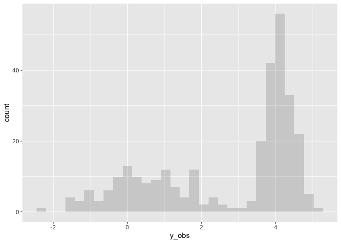
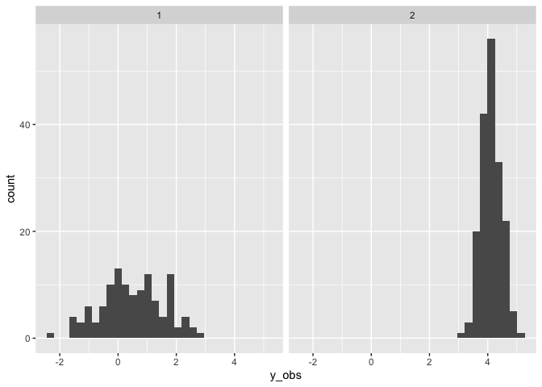
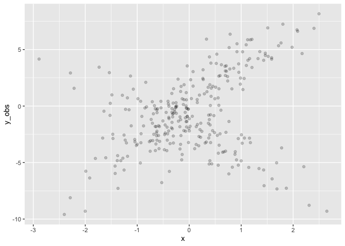
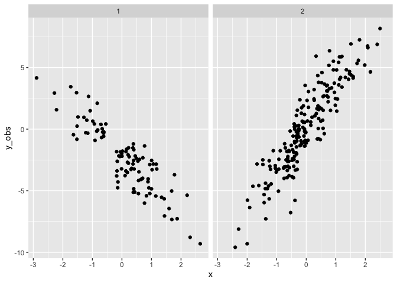
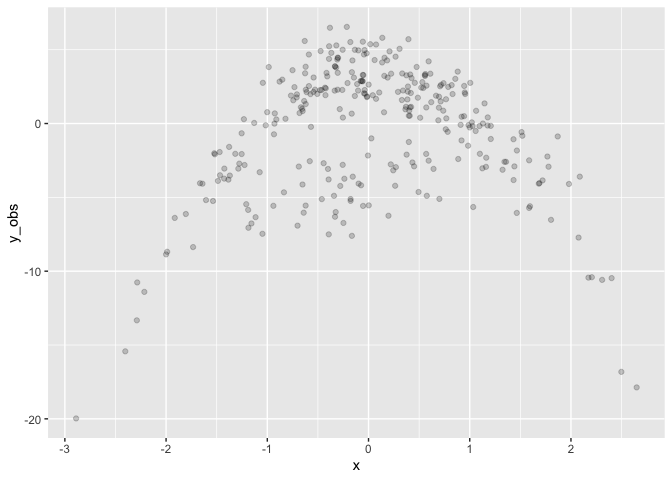
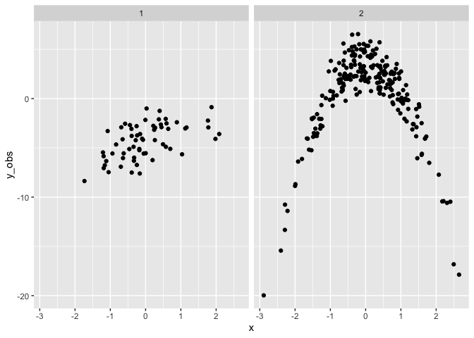

I couldn’t find much on the interblogs on finite mixture modelling using
**brms** so I’ve provided this document to offer some practical code to
help develop and apply a mixture model as a starting point.

<br>

## Finite Mixture Models

From Wikipedia:

> In statistics, a mixture model is a probabilistic model for
> representing the presence of subpopulations within an overall
> population, without requiring that an observed data set should
> identify the sub-population to which an individual observation
> belongs. Formally a mixture model corresponds to the mixture
> distribution that represents the probability distribution of
> observations in the overall population. However, while problems
> associated with “mixture distributions” relate to deriving the
> properties of the overall population from those of the
> sub-populations, “mixture models” are used to make statistical
> inferences about the properties of the sub-populations given only
> observations on the pooled population, without sub-population identity
> information.

Worked examples of finite mixture models in **brms** from Paul Burkner:
<http://paul-buerkner.github.io/brms/reference/mixture.html>

Mixture models may be used directly for modeling data with multimodal
distributions, or they may be used as priors for other parameters. For
example a multilevel mixture model:

`brm(y ~ x + z + (1 | g), family = mixture(gaussian, gaussian))`

<br>

Or a growth mixture model:

`brm(y ~ time + z + (1 + time | g), family = mixture(gaussian, gaussian))`

<https://m-clark.github.io/mixed-models-with-R/bayesian.html#beyond-the-model>

<br>

Note: See the **brms** formula help for details on the mixture model
specification

<http://paul-buerkner.github.io/brms/reference/brmsformula.html>

<br>

Finite mixture models are usually latent categorical variables, which
are made possible in Stan by marginalizing out the discrete parameters
(e.g., cluster membership). The cluster membership can then be recovered
in the generated quantities block, as described next.
(<https://mc-stan.org/docs/2_18/stan-users-guide/mixture-modeling-chapter.html>)

<br>

#### Recovering posterior mixture proportions

The posterior p(z) over the mixture indicator (z ∈ 1:K) is often of
interest as p(z = k) is the posterior probability that that observation
y was generated by mixture component k. The posterior can be computed
via Bayes’s rule. The normalization can be done via summation, because z
∈ 1:K only takes on finitely many values.  
(<https://mc-stan.org/docs/2_18/stan-users-guide/summing-out-the-responsibility-parameter.html>)

The generated quantities block may be used to draw discrete parameter
values using the built-in pseudo-random number generators. For example
see categorical_logit_rng() in the section titled Discrete Sampling:  
<https://mc-stan.org/docs/2_18/stan-users-guide/change-point-section.html>

<br>

## Simulation

Simulation involves specifying the model in **brms** and then sampling
from the priors to *draw* a single dataset.

Below we specify a simple mixture model with two Gaussian distributions
in **brms**, via the prior specification. The parameters `mu1` and
`mu2`, and `sigma1` and `sigma2`, are the means and standard deviations
of each distribution respectively. The location of each distribution
needs to be different for identification purposes, otherwise any single
observation will be exchangable between any of the distributions and the
model will not fit.

`theta` is the mixing proportion, representing the relative size of each
distribution.

``` r
# brms requires a dataset even though it will not be used to sample from the 
# priors

set.seed(1) # for replicability

d <- tibble(
  y = c(rnorm(200), rnorm(100, 6)) # mu1 = N(0,1), mu2 = N(6,1), theta = 0.66
)

# Specify the mixture model for brms
mix <- mixture(gaussian, gaussian)


# Specify the parameters of the Gaussians, as well as theta
priors <- get_prior(formula = bf(y ~ 1), 
                    data = d, 
                    family = mix)

priors$prior[1] <- set_prior("constant(1)", class = "sigma1")
priors$prior[2] <- set_prior("gamma(1, 3)", class = "sigma2")
priors$prior[3] <- set_prior("dirichlet(0.66, 0.33)", class = "theta")
priors$prior[4] <- set_prior("normal(0, 1)", class="Intercept", dpar = "mu1")
priors$prior[5] <- set_prior("normal(5, 1)", class="Intercept", dpar = "mu2")
```

After specifying the priors (i.e., parameters), we build (fit) the model
using `sample_prior = "only"`.

``` r
mix.1 <- brm(formula = bf(y ~ 1), 
             data = d, 
             family = mix,
             prior = priors, 
             sample_prior = "only",
             seed = 1,
             file = "../assets/mixtures_mix1.rds") 
```

    ##  Family: mixture(gaussian, gaussian) 
    ##   Links: mu1 = identity; sigma1 = identity; mu2 = identity; sigma2 = identity; theta1 = identity; theta2 = identity 
    ## Formula: y ~ 1 
    ##    Data: d (Number of observations: 300) 
    ##   Draws: 4 chains, each with iter = 2000; warmup = 1000; thin = 1;
    ##          total post-warmup draws = 4000
    ## 
    ## Population-Level Effects: 
    ##               Estimate Est.Error l-95% CI u-95% CI Rhat Bulk_ESS Tail_ESS
    ## mu1_Intercept    -0.03      0.98    -1.89     1.77 1.00     2428     2595
    ## mu2_Intercept     5.03      1.01     3.06     7.05 1.00     4232     2899
    ## 
    ## Family Specific Parameters: 
    ##        Estimate Est.Error l-95% CI u-95% CI Rhat Bulk_ESS Tail_ESS
    ## sigma1     1.00      0.00     1.00     1.00   NA       NA       NA
    ## sigma2     0.33      0.33     0.01     1.18 1.00     2342     1877
    ## theta1     0.67      0.33     0.01     1.00 1.00     2488     1368
    ## theta2     0.33      0.33     0.00     0.99 1.00     2488     1368
    ## 
    ## Draws were sampled using sampling(NUTS). For each parameter, Bulk_ESS
    ## and Tail_ESS are effective sample size measures, and Rhat is the potential
    ## scale reduction factor on split chains (at convergence, Rhat = 1).

<br>

After specifying and building the model we can draw a single dataset
from it to create simulated data using `posterior_predict`.

``` r
set.seed(5) # for replicability  

# Simulate data from the parameterized model
sim_data <- d %>%
  mutate(
    y_obs = c(t(posterior_predict(mix.1, nsamples = 1)))
  )
```

<!-- -->

<br>

Finally we can fit a mixture model to the simulated data. Note this fit
has much wider priors than the original specification.

``` r
sim.1 <- brm(bf(y_obs ~ 1), 
               sim_data, 
               family = mix,
               prior = c(
                 prior(normal(0, 7), Intercept, dpar = mu1),
                 prior(normal(5, 7), Intercept, dpar = mu2)),
               init=0,
               seed=1,
               file = "../assets/mixtures_sim1.rds") 
```

    ##  Family: mixture(gaussian, gaussian) 
    ##   Links: mu1 = identity; sigma1 = identity; mu2 = identity; sigma2 = identity; theta1 = identity; theta2 = identity 
    ## Formula: y_obs ~ 1 
    ##    Data: sim_data (Number of observations: 300) 
    ##   Draws: 4 chains, each with iter = 2000; warmup = 1000; thin = 1;
    ##          total post-warmup draws = 4000
    ## 
    ## Population-Level Effects: 
    ##               Estimate Est.Error l-95% CI u-95% CI Rhat Bulk_ESS Tail_ESS
    ## mu1_Intercept     0.51      0.11     0.30     0.74 1.00     2126     2102
    ## mu2_Intercept     4.13      0.03     4.07     4.18 1.00     4584     2771
    ## 
    ## Family Specific Parameters: 
    ##        Estimate Est.Error l-95% CI u-95% CI Rhat Bulk_ESS Tail_ESS
    ## sigma1     1.15      0.09     0.99     1.33 1.00     3009     2366
    ## sigma2     0.35      0.02     0.31     0.39 1.00     2922     2161
    ## theta1     0.40      0.03     0.34     0.45 1.00     3386     2479
    ## theta2     0.60      0.03     0.55     0.66 1.00     3386     2479
    ## 
    ## Draws were sampled using sampling(NUTS). For each parameter, Bulk_ESS
    ## and Tail_ESS are effective sample size measures, and Rhat is the potential
    ## scale reduction factor on split chains (at convergence, Rhat = 1).

The fit of the simulated data has recovered the original parameters
well. `mu1` and `sigma1` are close to 0 and 1 respectively. `mu2` and
`sigma2` are close to 5 and 0.33 respectively. However the relative
sizes of `theta1` and `theta2` are 0.4 and 0.6 respectively, which is
the reverse of the true model (0.66, 0.33).

#### Recovering the clusters

From wikipedia:
<https://en.wikipedia.org/wiki/Probability_density_function>

> while the absolute likelihood for a continuous random variable to take
> on any particular value is 0 (since there is an infinite set of
> possible values to begin with), the value of the PDF at two different
> samples can be used to infer, in any particular draw of the random
> variable, how much more likely it is that the random variable would be
> close to one sample compared to the other sample.

Note that when x has the same density in both distributions, we need the
denominator in Bayes rule (i.e., `theta`) to correctly adjust posterior
probability!

``` r
#  https://stats.stackexchange.com/questions/363046/probability-that-an-observation-comes-from-population-a-or-b  

est = posterior_summary(sim.1)[, 'Estimate']

relative_p <- function(.y,  
                       mu1=est[['b_mu1_Intercept']], 
                       mu2=est[['b_mu2_Intercept']],
                       sigma1=est[['sigma1']], 
                       sigma2=est[['sigma2']],
                       denom1=est[['theta1']], 
                       denom2=est[['theta2']]) {
  
  d1 <- dnorm(.y, mu1, sigma1) * denom1
  d2 <- dnorm(.y, mu2, sigma2) * denom2

  out = c(d1 / (d1 + d2),
          d2 / (d1 + d2))
  
  return(out)
}

p <- sim_data %>%
  rowwise() %>%
  mutate(
    p_mu1 = relative_p(.y = y_obs)[1],
    p_mu2 = relative_p(.y = y_obs)[2],
    p_max = which.max(c(p_mu1, p_mu2))
  ) 
```

<!-- -->

<br>

<br>

## Add a mixture of slopes

So far we have just modelled a mixture of intercepts, so adding a
mixture of slopes is straightforward. However note that the slopes will
not have different mixtures.

``` r
# add an x variable to the data (which is required but will not be used)

set.seed(1)
d <- d %>%
  mutate(x = rnorm(300))

# Customise the priors we need to specify for an intercept + slope model
priors <- get_prior(bf(y ~ 1 + x), 
                    d, 
                    family = mix)

priors$prior[1] <- set_prior("constant(1.5)", class = "sigma1")
priors$prior[2] <- set_prior("constant(1.5)", class = "sigma2")
priors$prior[3] <- set_prior("dirichlet(1)", class = "theta")
priors$prior[4] <- set_prior("normal(-3, 1)", class="b", dpar = "mu1")
priors$prior[6] <- set_prior("normal(0, 3)", class="Intercept", dpar = "mu1")
priors$prior[7] <- set_prior("normal(3, 1)", class="b", dpar = "mu2")
priors$prior[9] <- set_prior("normal(0, 3)", class="Intercept", dpar = "mu2")


mix.2 <- brm(bf(y ~ x), 
             d, 
             family = mix,
             prior = priors, 
             sample_prior = "only",
             seed = 1,
             file = "../assets/mixtures_mix2.rds"
             )
```

    ##  Family: mixture(gaussian, gaussian) 
    ##   Links: mu1 = identity; sigma1 = identity; mu2 = identity; sigma2 = identity; theta1 = identity; theta2 = identity 
    ## Formula: y ~ x 
    ##    Data: d (Number of observations: 300) 
    ##   Draws: 4 chains, each with iter = 2000; warmup = 1000; thin = 1;
    ##          total post-warmup draws = 4000
    ## 
    ## Population-Level Effects: 
    ##               Estimate Est.Error l-95% CI u-95% CI Rhat Bulk_ESS Tail_ESS
    ## mu1_Intercept    -1.61      2.49    -6.65     3.09 1.00     2450     1954
    ## mu2_Intercept     1.56      2.49    -3.11     6.56 1.00     4942     3205
    ## mu1_x            -3.03      0.96    -4.92    -1.18 1.00     3539     2352
    ## mu2_x             3.00      0.98     1.10     4.90 1.00     3717     2405
    ## 
    ## Family Specific Parameters: 
    ##        Estimate Est.Error l-95% CI u-95% CI Rhat Bulk_ESS Tail_ESS
    ## sigma1     1.50      0.00     1.50     1.50   NA       NA       NA
    ## sigma2     1.50      0.00     1.50     1.50   NA       NA       NA
    ## theta1     0.50      0.29     0.03     0.98 1.00     3554     2059
    ## theta2     0.50      0.29     0.02     0.97 1.00     3554     2059
    ## 
    ## Draws were sampled using sampling(NUTS). For each parameter, Bulk_ESS
    ## and Tail_ESS are effective sample size measures, and Rhat is the potential
    ## scale reduction factor on split chains (at convergence, Rhat = 1).

<br>

Drawing a single dataset

``` r
set.seed(4) # for replicability

# Simulate data from the parameterized model
sim_data <- d %>%
  mutate(
    y_obs = c(t(posterior_predict(mix.2, nsamples = 1)))
  )
```

<!-- -->

<br>

Fit the simulated data. Note the priors for the slopes (`mu1_x` and
`mu2_x`) are steeper and wider than the truth.

``` r
# fit the simulated data
custom_priors <- get_prior(bf(y_obs ~ 1 + x), 
                           sim_data, 
                           family = mix)

custom_priors$prior[1] <- set_prior("gamma(2, 2)", class = "sigma1")
custom_priors$prior[2] <- set_prior("gamma(2, 2)", class = "sigma2")
custom_priors$prior[4] <- set_prior("normal(-5, 3)", class="b", dpar = "mu1")
custom_priors$prior[6] <- set_prior("normal(0, 3)", class="Intercept", dpar = "mu1")
custom_priors$prior[7] <- set_prior("normal(5, 3)", class="b", dpar = "mu2")
custom_priors$prior[9] <- set_prior("normal(0, 3)", class="Intercept", dpar = "mu2")

sim.2 <- brm(bf(y_obs ~ 1 + x), 
             sim_data, 
             family = mix,
             prior = custom_priors,
             init = 0,
             seed = 1,
             file = "../assets/mixtures_sim2.rds"
) 
```

    ##  Family: mixture(gaussian, gaussian) 
    ##   Links: mu1 = identity; sigma1 = identity; mu2 = identity; sigma2 = identity; theta1 = identity; theta2 = identity 
    ## Formula: y_obs ~ 1 + x 
    ##    Data: sim_data (Number of observations: 300) 
    ##   Draws: 4 chains, each with iter = 2000; warmup = 1000; thin = 1;
    ##          total post-warmup draws = 4000
    ## 
    ## Population-Level Effects: 
    ##               Estimate Est.Error l-95% CI u-95% CI Rhat Bulk_ESS Tail_ESS
    ## mu1_Intercept    -2.17      0.16    -2.49    -1.86 1.00     2357     2979
    ## mu2_Intercept     0.13      0.13    -0.13     0.39 1.00     3873     3523
    ## mu1_x            -2.15      0.15    -2.44    -1.85 1.00     3855     2805
    ## mu2_x             3.33      0.13     3.08     3.58 1.00     4730     2827
    ## 
    ## Family Specific Parameters: 
    ##        Estimate Est.Error l-95% CI u-95% CI Rhat Bulk_ESS Tail_ESS
    ## sigma1     1.37      0.13     1.14     1.64 1.00     3791     2898
    ## sigma2     1.59      0.10     1.40     1.80 1.00     3972     3144
    ## theta1     0.39      0.04     0.31     0.46 1.00     4373     2810
    ## theta2     0.61      0.04     0.54     0.69 1.00     4373     2810
    ## 
    ## Draws were sampled using sampling(NUTS). For each parameter, Bulk_ESS
    ## and Tail_ESS are effective sample size measures, and Rhat is the potential
    ## scale reduction factor on split chains (at convergence, Rhat = 1).

<br>

Recovering the clusters

``` r
est = posterior_summary(sim.2)[, 'Estimate']

relative_p <- function(.y, .x, 
                       mu1=est[['b_mu1_Intercept']], 
                       mu1x=est[['b_mu1_x']], 
                       mu2=est[['b_mu2_Intercept']],
                       mu2x = est[['b_mu2_x']],
                       sigma1=est[['sigma1']], 
                       sigma2=est[['sigma2']],
                       denom1=est[['theta1']], 
                       denom2=est[['theta2']]) {
  
  d1 <- dnorm(.y, mu1 + .x*mu1x, sigma1) * denom1
  d2 <- dnorm(.y, mu2 + .x*mu2x, sigma2) * denom2

  out = c(d1 / (d1 + d2),
          d2 / (d1 + d2))
  
  return(out)
}

p <- sim_data %>%
  rowwise() %>%
  mutate(
    p_mu1 = relative_p(.y = y_obs, .x = x)[1],
    p_mu2 = relative_p(.y = y_obs, .x = x)[2],
    p_max = which.max(c(p_mu1, p_mu2))
  ) %>%
  ungroup()
```

<!-- -->

<br>

<br>

## Adding a parametric term

``` r
# add an x^2 variable to the data (which is required but will not be used)

d <- d %>%
  mutate(x2 = x*x)

# Customise the priors we need to specify for an intercept + slope model
priors <- get_prior(bf(y ~ 1 + x + x2), 
                    d, 
                    family = mix)

priors$prior[1] <- set_prior("constant(1.5)", class="sigma1")
priors$prior[2] <- set_prior("constant(1.5)", class="sigma2")
priors$prior[3] <- set_prior("dirichlet(1)",  class="theta")
priors$prior[5] <- set_prior("normal(1, 1)",  class="b", coef="x",  dpar="mu1")
priors$prior[6] <- set_prior("normal(0, 1)",  class="b", coef="x2", dpar="mu1")
priors$prior[7] <- set_prior("normal(0, 3)",  class="Intercept",    dpar="mu1")
priors$prior[9] <- set_prior("normal(0, 1)",  class="b", coef="x",  dpar="mu2")
priors$prior[10] <- set_prior("normal(-3, 1)", class="b", coef="x2", dpar="mu2")
priors$prior[11] <- set_prior("normal(0, 3)", class="Intercept",    dpar="mu2")


mix.3 <- brm(bf(y ~ 1 + x + x2), 
             d, 
             family = mix,
             prior = priors, 
             sample_prior = "only",
             seed = 1,
             init=0,
             file = "../assets/mixtures_mix3.rds"
             )
```

    ##  Family: mixture(gaussian, gaussian) 
    ##   Links: mu1 = identity; sigma1 = identity; mu2 = identity; sigma2 = identity; theta1 = identity; theta2 = identity 
    ## Formula: y ~ 1 + x + x2 
    ##    Data: d (Number of observations: 300) 
    ##   Draws: 4 chains, each with iter = 2000; warmup = 1000; thin = 1;
    ##          total post-warmup draws = 4000
    ## 
    ## Population-Level Effects: 
    ##               Estimate Est.Error l-95% CI u-95% CI Rhat Bulk_ESS Tail_ESS
    ## mu1_Intercept    -1.79      2.70    -7.22     3.26 1.00     2543     1956
    ## mu2_Intercept     4.46      2.68    -0.63     9.99 1.00     4229     3208
    ## mu1_x             1.01      0.96    -0.90     2.89 1.00     3823     2981
    ## mu1_x2            0.03      1.02    -1.95     2.06 1.00     3813     2648
    ## mu2_x             0.01      0.99    -1.98     1.94 1.00     3374     3004
    ## mu2_x2           -2.98      1.00    -4.93    -0.96 1.00     3672     2674
    ## 
    ## Family Specific Parameters: 
    ##        Estimate Est.Error l-95% CI u-95% CI Rhat Bulk_ESS Tail_ESS
    ## sigma1     1.50      0.00     1.50     1.50   NA       NA       NA
    ## sigma2     1.50      0.00     1.50     1.50   NA       NA       NA
    ## theta1     0.50      0.28     0.03     0.97 1.00     3820     2581
    ## theta2     0.50      0.28     0.03     0.97 1.00     3820     2581
    ## 
    ## Draws were sampled using sampling(NUTS). For each parameter, Bulk_ESS
    ## and Tail_ESS are effective sample size measures, and Rhat is the potential
    ## scale reduction factor on split chains (at convergence, Rhat = 1).

Drawing a single dataset

``` r
set.seed(8) # 8 or 3 for replicability

# Simulate data from the parameterized model
sim_data <- d %>%
  mutate(
    y_obs = c(t(posterior_predict(mix.3, nsamples = 1)))
  )
```

<!-- -->

Fit the simulated data. Note the priors for the slopes (`mu1_x` and
`mu2_x`) are steeper and wider than the truth.

``` r
# fit the simulated data
custom_priors <- get_prior(bf(y_obs ~ 1 + x + x2), 
                           sim_data, 
                           family = mix)

custom_priors$prior[1] <- set_prior("gamma(2, 2)", class="sigma1")
custom_priors$prior[2] <- set_prior("gamma(2, 2)", class="sigma2")
custom_priors$prior[5] <- set_prior("normal(1, 3)", class="b", coef="x",  dpar="mu1")
custom_priors$prior[6] <- set_prior("normal(0, 3)", class="b", coef="x2", dpar="mu1")
custom_priors$prior[7] <- set_prior("normal(0, 3)", class="Intercept",    dpar="mu1")
custom_priors$prior[9]  <- set_prior("normal(0, 3)",  class="b", coef="x",  dpar="mu2")
custom_priors$prior[10] <- set_prior("normal(-3, 3)", class="b", coef="x2", dpar="mu2")
custom_priors$prior[11] <- set_prior("normal(0, 3)",  class="Intercept",    dpar="mu2")

sim.3 <- brm(bf(y_obs ~ 1 + x + x2), 
             sim_data, 
             family = mix,
             prior = custom_priors,
             init = 0,
             seed = 1,
             file = "../assets/mixtures_sim3.rds"
) 
```

    ##  Family: mixture(gaussian, gaussian) 
    ##   Links: mu1 = identity; sigma1 = identity; mu2 = identity; sigma2 = identity; theta1 = identity; theta2 = identity 
    ## Formula: y_obs ~ 1 + x + x2 
    ##    Data: sim_data (Number of observations: 300) 
    ##   Draws: 4 chains, each with iter = 2000; warmup = 1000; thin = 1;
    ##          total post-warmup draws = 4000
    ## 
    ## Population-Level Effects: 
    ##               Estimate Est.Error l-95% CI u-95% CI Rhat Bulk_ESS Tail_ESS
    ## mu1_Intercept    -3.91      0.29    -4.45    -3.33 1.00     3940     3182
    ## mu2_Intercept     3.39      0.12     3.16     3.62 1.00     4899     3877
    ## mu1_x             1.41      0.32     0.76     2.02 1.00     4750     3164
    ## mu1_x2           -0.39      0.26    -0.88     0.12 1.00     4106     2665
    ## mu2_x             0.07      0.11    -0.14     0.28 1.00     6316     2721
    ## mu2_x2           -2.91      0.07    -3.04    -2.77 1.00     6486     3241
    ## 
    ## Family Specific Parameters: 
    ##        Estimate Est.Error l-95% CI u-95% CI Rhat Bulk_ESS Tail_ESS
    ## sigma1     1.59      0.17     1.29     1.98 1.00     4668     3067
    ## sigma2     1.41      0.07     1.28     1.56 1.00     5663     3134
    ## theta1     0.23      0.03     0.18     0.28 1.00     6267     2817
    ## theta2     0.77      0.03     0.72     0.82 1.00     6267     2817
    ## 
    ## Draws were sampled using sampling(NUTS). For each parameter, Bulk_ESS
    ## and Tail_ESS are effective sample size measures, and Rhat is the potential
    ## scale reduction factor on split chains (at convergence, Rhat = 1).

<br>

Recovering the clusters

``` r
est = posterior_summary(sim.3)[, 'Estimate']

relative_p <- function(.y, .x, .x2,
                       mu1=  est[['b_mu1_Intercept']], 
                       mu1x= est[['b_mu1_x']],
                       mu1x2=est[['b_mu1_x2']],
                       mu2=  est[['b_mu2_Intercept']],
                       mu2x= est[['b_mu2_x']],
                       mu2x2=est[['b_mu2_x2']],
                       sigma1=est[['sigma1']], 
                       sigma2=est[['sigma2']],
                       denom1=est[['theta1']], 
                       denom2=est[['theta2']]) {
  
  d1 <- dnorm(.y, mu1 + .x*mu1x + .x2*mu1x2, sigma1) * denom1
  d2 <- dnorm(.y, mu2 + .x*mu2x + .x2*mu2x2, sigma2) * denom2

  out = c(d1 / (d1 + d2),
          d2 / (d1 + d2))
  
  return(out)
}

p <- sim_data %>%
  rowwise() %>%
  mutate(
    p_mu1 = relative_p(.y = y_obs, .x = x, .x2 = x2)[1],
    p_mu2 = relative_p(.y = y_obs, .x = x, .x2 = x2)[2],
    p_max = which.max(c(p_mu1, p_mu2))
  ) %>%
  ungroup()
```

<!-- -->

<br>

<br>
